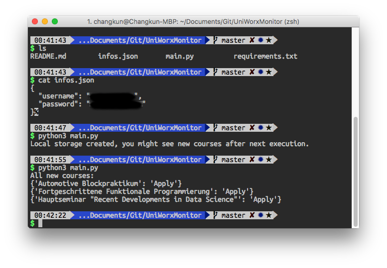

# UniWorX Monitor

Simple Python script to monitor LMU UniWorX courses.

> IF YOU HAVE ANY PROBLEM AND IMPROVEMENT IDEA, PLEASE [OPEN AN ISSUE](https://github.com/changkun/UniWorXMonitor/issues)  OR START A PULL REQUEST THAT HELPS ME IMPROVE THIS PROJECT.

## Usage

**Install dependencies**:

```bash
sudo pip install -r requirements.txt
# or
sudo pip3 install -r requirements.txt
```

**Configure your account**:

Fill your information inside [infos.json](./infos.json)

**Run**:

```bash
python main.py
# or
python3 main.py
```

> **Note**:
> 
> 1. Your first execution will create a json file to store all courses status
> 2. **Afterwards** every time you run this script can monitor the website for any course status change
> 3. Terminal output gives you the up-to-date changes informations for you, you can also check the `log.txt` for change history.

## Example Result

**Local store sample**:

[courses.json](./courses.json)

**Execution sample**:



## AUTOMATED TASK for macOS

Every day automatic execution with notification. 

**Example:**


Please read [autotask/README.md](autotask/README.md) for setup guideline.


## License

MIT
