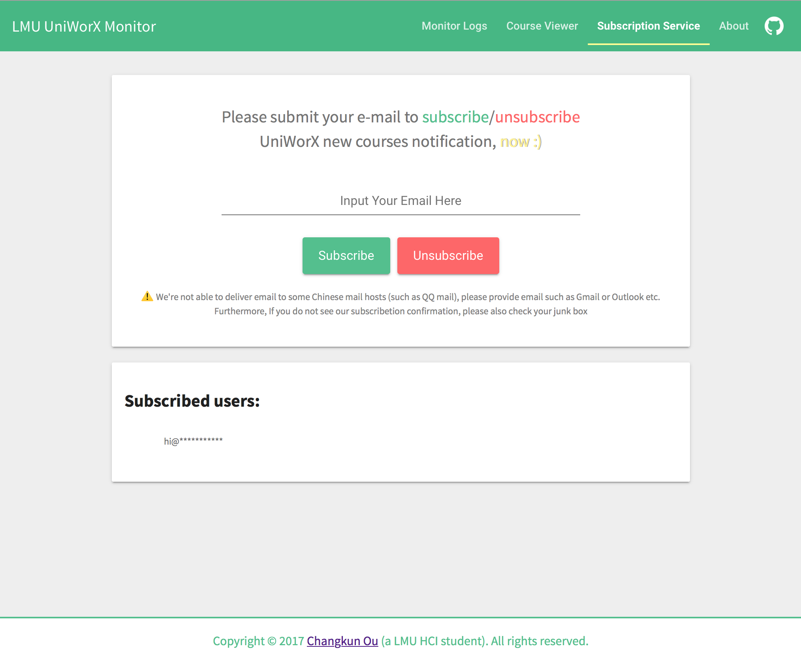

# UniWorX Monitor

    

A better LMU UniWorX System with new courses notifications.

> IF YOU HAVE ANY PROBLEM AND IMPROVEMENT IDEA, PLEASE [OPEN AN ISSUE](https://github.com/changkun/UniWorXMonitor/issues)  OR START A PULL REQUEST THAT HELPS ME IMPROVE THIS PROJECT.


## CMD Version

### **Install dependencies**:

To run UniWorX Monitor CMD version, please `cd` into `cmd` folder. And you also need install requirements:

```bash
sudo pip3 install -r requirements.txt
```

### **Configure your account**:

Fill your UniWorX account information inside [infos.json](./cmd/infos.json)

### **Run**:

Then you are free to go:

```bash
python3 main.py
```

> **Note**:
> 
> 1. Your first execution will create a json file to store all courses status if you removed the courses.json inside the repo folder;
> 2. **Afterwards** every time you execute this script can monitor the UniWorX for any course status change;
> 3. Terminal output gives you the up-to-date changes informations for you, you can also check the `log.txt` for change history.

---

### Example Result

**Local store sample**:

[courses.json](./cmd/courses.json)

**Local logs**:

[log.txt](./cmd/log.txt)

**Execution sample**:


### AUTOMATED TASK

> The section related file is placed on [autotask](./cmd/autotask)

#### for macOS

Daily automated execution with notification. 

**Example:**


Please read [autotask/README.md](./cmd/autotask/README.md) for setup guide.

##### for Windows/Linux

You might need find your own setup method, but PR welcome!

## WEB Version

> The section related file is placed on [frontend](./frontend) and [backend](./backend)
> 
> Web service is still in development.

You can visit: http://changkun.de/uniworx



## GUI VERSION

> GUI desktop version will be developed based on web version

## License

[MIT](./LICENSE) © Changkun
