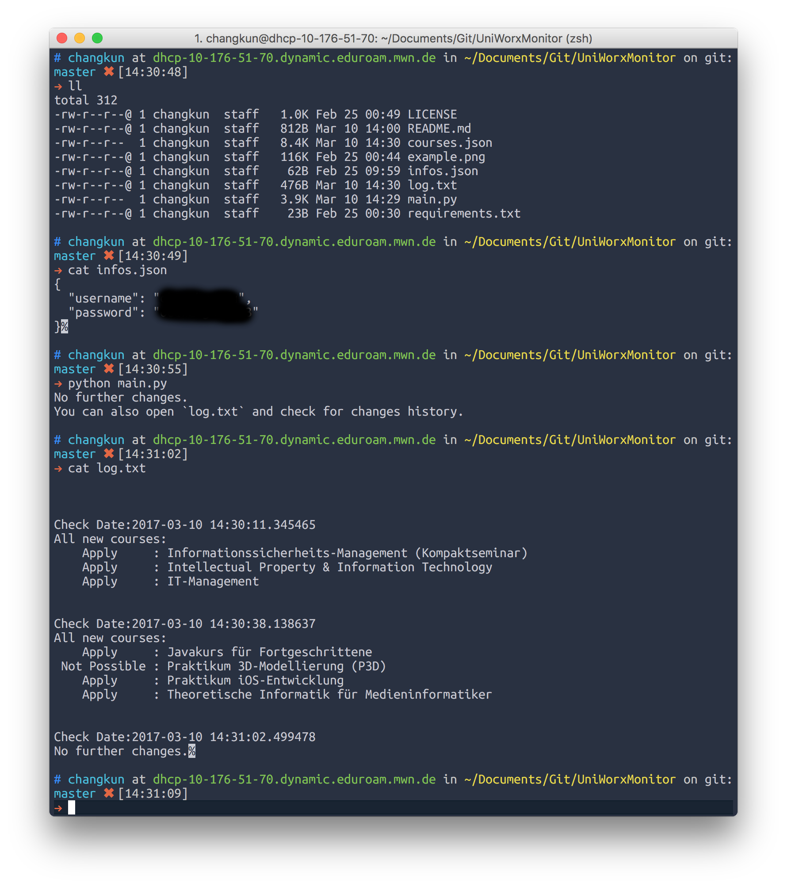
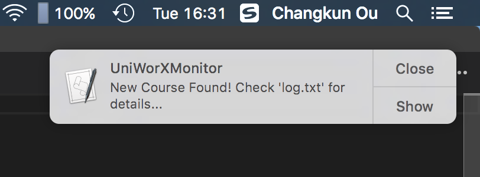
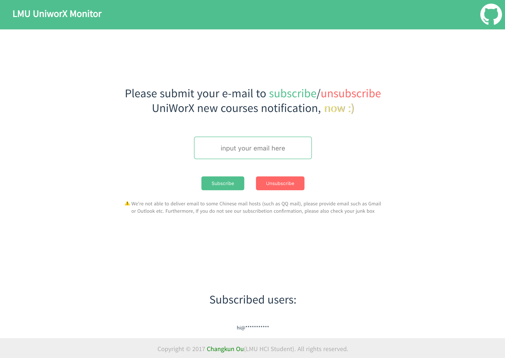

# UniWorX Monitor

    

Automatable Python script to monitor LMU UniWorX courses.


## Quick Usage

### **Basics**:

1. **Make sure** that you have [Python](https://www.python.org/) and [Pip](https://pypi.python.org/pypi/pip) running on your OS;
2. **Clone** this repo to your local folder;
3. `cd` into that folder for further operations. 

### **Install dependencies**:

To run UniWorX Monitor, you also need install requirements.

```bash
sudo pip install -r requirements.txt
# or
sudo pip3 install -r requirements.txt
```

### **Configure your account**:

Fill your UniWorX account information inside [infos.json](./infos.json)

### **Run**:

Then you are free to go:

```bash
python main.py
# or
python3 main.py
```

> **Note**:
> 
> 1. Your first execution will create a json file to store all courses status if you removed the courses.json inside the repo folder;
> 2. **Afterwards** every time you execute this script can monitor the UniWorX for any course status change;
> 3. Terminal output gives you the up-to-date changes informations for you, you can also check the `log.txt` for change history.

## Example Result

**Local store sample**:

[courses.json](./courses.json)

**Local logs**:

[log.txt](./log.txt)

**Execution sample**:



## Advanced Functions

> I am currently making some advanced functions, such as AUTOMATED TASK, WEB SERVICE and GUI VERSION.
> 
> IF YOU HAVE ANY PROBLEM AND IMPROVEMENT IDEA, PLEASE [OPEN AN ISSUE](https://github.com/changkun/UniWorXMonitor/issues)  OR START A PULL REQUEST THAT HELPS ME IMPROVE THIS PROJECT.

### 1. AUTOMATED TASK

> The section related file is placed on [autotask](./autotask)

#### for macOS

Daily automated execution with notification. 

**Example:**



Please read [autotask/README.md](autotask/README.md) for setup guide.

#### for Windows/Linux

You might need find your own setup method, but PR welcome!

### 2. WEB SERVICE

> The section related file is placed on [monitorweb](./monitorweb)

You can visit: http://changkun.de/uniworx



### 3. GUI VERSION

> Not developed yet.

## License

[MIT](./LICENSE) © Changkun
