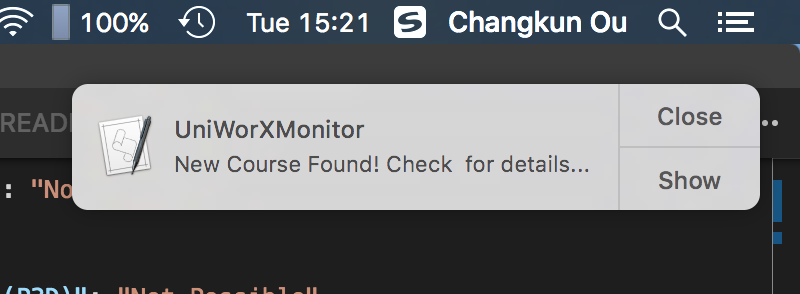

# AUTOMATED TASK for macOS

Please read this specification carefully for setup automated execute task script.

Before you setup the automated task, please make sure you already execute UniWorXMonitor succefully at least once to avoid any potential errors.

## Step 1: config your `.plist` file

Please edit your [`us.changkun.uniworxmonitor.launchctl.plist`](./us.changkun.uniworxmonitor.launchctl.plist), and modify the following content:

```xml
<string>/PATH/TO/YOUR/auto.sh</string>
<string>/PATH/TO/YOUR/auto.log</string>
<string>/PATH/TO/YOUR/auto.err</string>
```

## Step 2: config your `auto.sh` file

Please edit your [`auto.sh`](./auto.sh) and modify the following content:

```
cd /PATH/TO/YOUR/UniworXMonitor
```

## Step 3: setup automated execution task

Move the `.plist` file to `~/Library/LaunchAgents`:

```bash
# move current .plist file to ~/Library/LaunchAgents
mv us.changkun.uniworxmonitor.launchctl.plist ~/Library/LaunchAgents
# load the .plist file
launchctl load ~/Library/LaunchAgents/us.changkun.uniworxmonitor.launchctl.plist

# for testing:
launchctl start ~/Library/LaunchAgents/us.changkun.uniworxmonitor.launchctl.plist
```


As results, system will execute the script automatically and notify you through system notification, for instance:




## Customization

You can edit your `.plit` file to specify the script execution time. You can edit the value of `<integer>` tag to specify other execute time:

```xml
<key>StartCalendarInterval</key>
<dict>
	<key>Minute</key>
	<integer>0</integer>
	<key>Hour</key>
	<integer>14</integer>
</dict>
```

the above configureation means the script will be execute at 14:00 per day.

You may need the script execute periodly. To to that, you can replace the `StartCalendarInterval` key and its `<dict>` to the following content:

```xml
<key>KeepAlive</key>
<false/>
<key>RunAtLoad</key>
<true/>
<key>StartInterval</key>
<integer>30</integer>
```

The above config make the script be executed per 30 sec.

When you modified the `.plist` file, you will need reload the `.plist` file:

```
launchctl unload <your.plist.file>
launchctl load <your.plist.file>
```

## Termination

If you wish stop the system automated task, you will need the following command:

```
launchctl stop <your.plist.file>
rm <your.plist.file>
``` 

> IF YOU HAVE ANY PROBLEM AND IMPROVEMENTS IDEA, PLEASE [OPEN AN ISSUE](https://github.com/changkun/UniWorXMonitor/issues)  OR START A PULL REQUEST THAT HELPS ME IMPROVE THIS PROJECT.