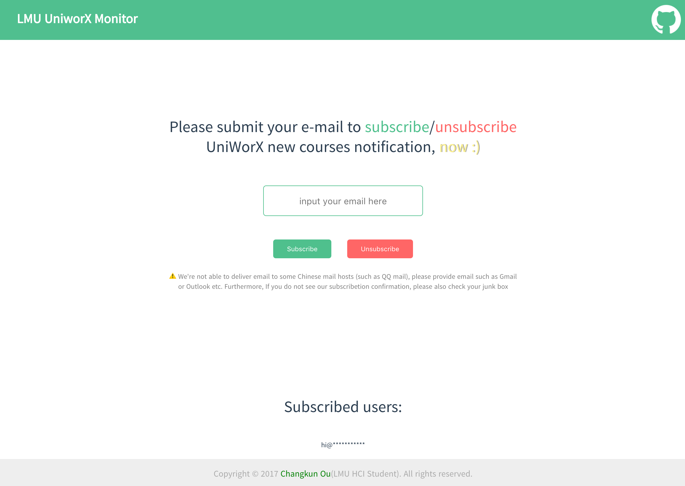

# MONITOR WEB SERVICE

This doc is for the person who wish to run UniWorX Monitor web service on their own server.



To install dependencies:

```bash
npm install
```

To development:

```bash
npm start
```

To run as production:

```bash
npm run product
```

Before you run as production, your server need:

1. set up a mail server
2. file an uniworx account and a mail manager in [./data/acount.json](./data/acount.json)

Good luck!

> IF YOU HAVE ANY PROBLEM AND IMPROVEMENTS IDEA, PLEASE [OPEN AN ISSUE](https://github.com/changkun/UniWorXMonitor/issues)  OR START A PULL REQUEST THAT HELPS ME IMPROVE THIS PROJECT.